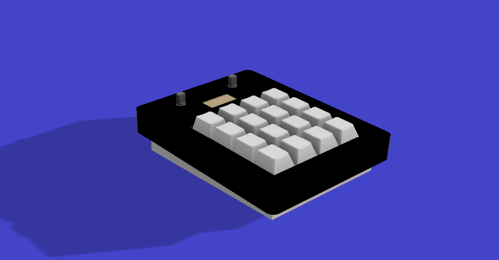
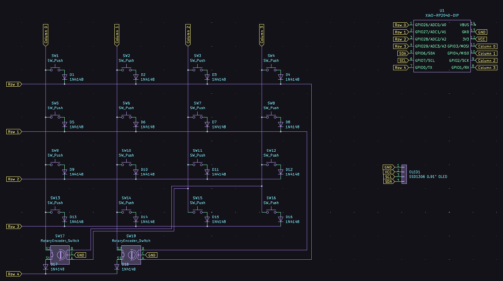
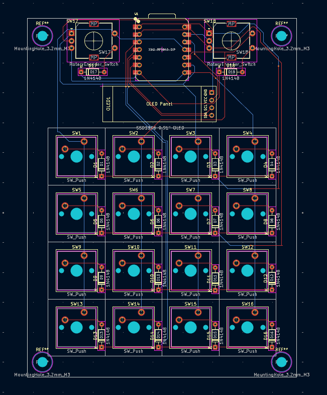
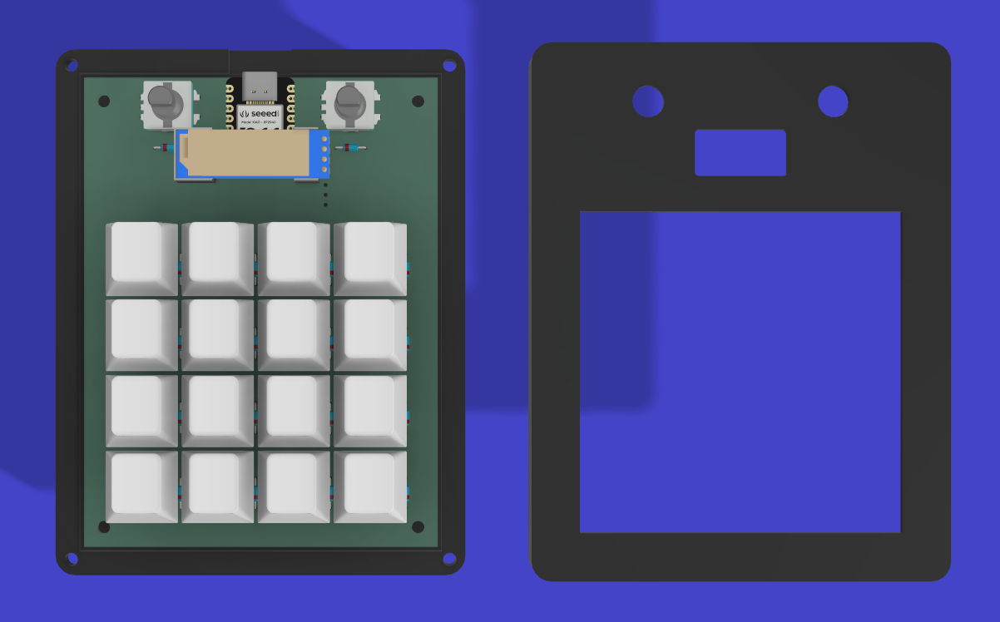

# Arwin's Numpad
A custom NumPad designed and built using **KiCad** for PCB design and **Fusion 360** for 3D modeling. This is my first hackpad project.

## Description
This project is a fully custom NumPad. The PCB and schematic are designed in KiCad, and the case and parts are modeled in Fusion 360. 

## Screenshots

### Overall Hackpad

### Schematic

### PCB Layout 

### Case

## Bill of Materials (BOM)
| Part | Quantity | Description |
|------|---------|-------------|
| Mechanical switches | 16 | Standard MX-compatible switches |
| Keycaps | 16 | Cherry-style keycaps |
| Xiao RP2040 | 1 | Microcontroller |
| 0.91 inch OLED Screen | 1 | Screen |
| Rotary Encoder | 2 | Dials |
| PCB | 1 | Custom-designed PCB |
| Screws / Standoffs | 8 | For case assembly |
| Heatset inserts| 8 | For case assembly |
| Case | 1 | 3D printed |

## Usage / Assembly
1. Fabricate the PCB according to the KiCad files.  
2. Solder everything onto the PCB.  
3. 3D Print the case and fit the PCB inside.  
4. Connect the microcontroller to your computer via USB and test functionality.  
